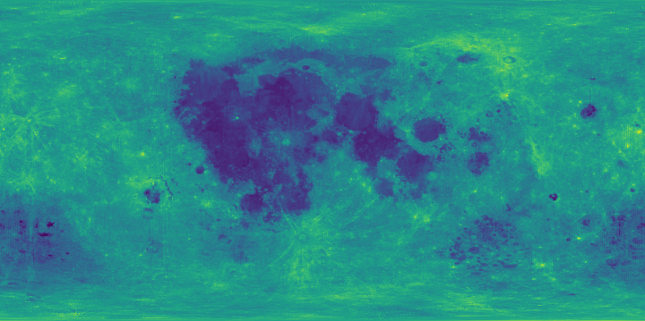
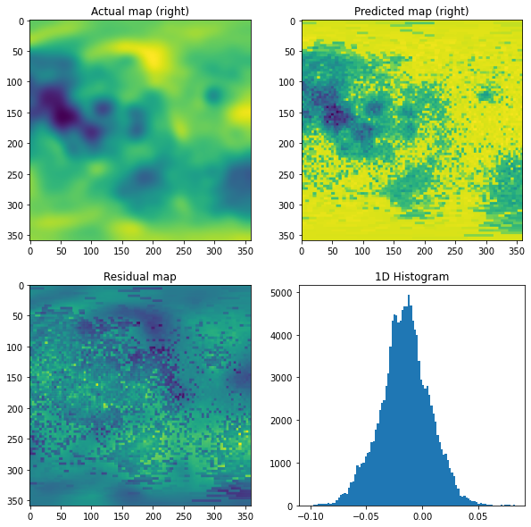

# Tasks:
Machine Learning Model for the Planetary Albedo 

# Task1:

## Prediction Results:

#### After a lot of hyper-parmeter tuning of neural network with 3 hidden layers we get best results for lr=0.00001, batch_size=64 and  epoxhs=200
<mark>RMSE=0.02742571975488747</mark>

### Lunar Albedo Prediction:

