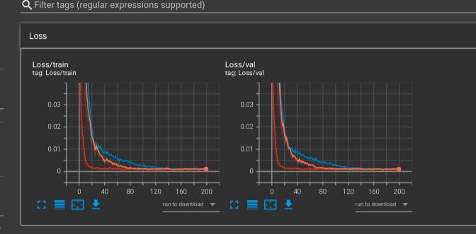
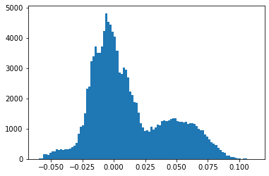

# Tasks:
Machine Learning Model for the Planetary Albedo 

# Task1:

## Prediction Results for normal:

#### After a lot of manual hyper-parmeter tuning of neural network with 3 hidden layers we get best results for lr=0.00001, batch_size=64 and  epochs=200

# Loss/Epoch Graph for different hyperparameters:

<mark>RMSE = 0.021777820362415982 ~ 0.02</mark>
<mark>R2 = 0.5114797708710908 ~ 0.5</mark>

## Prediction Results for nearby:
<mark>RMSE = 0.02398096107180612 ~ 0.02</mark>
<mark>R2 = 0.6268074896858192 ~ 0.6</mark>

### Lunar Albedo Prediction Normal:

### Lunar Albedo Prediction Nearby Pixels:

