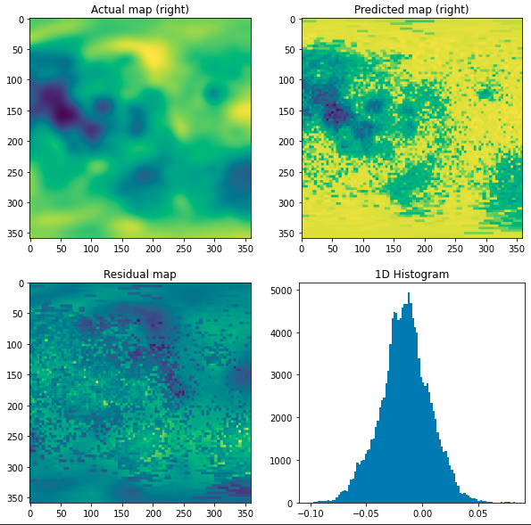

# Tasks:
Machine Learning Model for the Planetary Albedo 

# Future work that can be done:
#### 1.Try autoencoder(not just autoencoder could be any generative model) which takes in albedo as input and outputs chemical composition.
#### 2.Try RNN,LSTM,GRU in nearby pixel method which takes in nearby albedo as input and outputs chemical composition.

##### Above are some of my own ideas to solve the problem.(Not sure about idea No.2)

# Task1:

## Prediction Results for normal:

#### After a lot of manual hyper-parmeter tuning of neural network with 3 hidden layers we get best results for lr=0.00001, batch_size=64 and  epochs=200 for normal.

#### For nearby pixels method the graph convereged with epochs=100

# Loss/Epoch Curve for nearby plixels method:

# Loss/Epoch Curve for different hyperparameters in normal method:

<mark>RMSE = 0.021777820362415982 ~ 0.02</mark>
<mark>R2 = 0.5114797708710908 ~ 0.5</mark>

## Prediction Results for nearby:
<mark>RMSE = 0.02398096107180612 ~ 0.02</mark>
<mark>R2 = 0.6268074896858192 ~ 0.6</mark>

### Lunar Albedo Prediction Normal:

### Lunar Albedo Prediction Nearby Pixels:

# Task2:

#### In progress will be done soon.Need to mask the input mercury albedo according to the output missing valuse in chemical composition.

